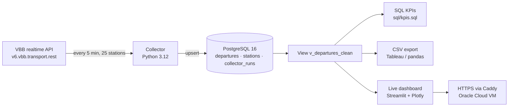

# Berlin Public Transport Delay Analytics

[](https://github.com/Anant2580/berlin-transit-delays/actions/workflows/ci.yml)


**How punctual is Berlin's public transport really?** This project collects live departure data for 25 Berlin stations every 5 minutes, stores planned and actual departure times in PostgreSQL, and turns them into KPIs such as on-time percentage, average delay per line and the most delayed stations.

Berlin's GTFS timetable files only contain the *planned* schedule, not real delays. To measure punctuality, the project collects realtime data itself and builds up its own history.

## Highlights

- **End-to-end data pipeline**: realtime REST API → Python collector → PostgreSQL → SQL analytics, running continuously in Docker.
- **Idempotent loading**: each departure is seen several times while it approaches; an `INSERT … ON CONFLICT` upsert updates one row per departure instead of creating duplicates.
- **Fault tolerance**: timeouts, retries with exponential backoff, and a circuit breaker keep the collector running when the public API is slow or down.
- **Data quality built in**: every collector run is logged, so gaps, failed requests and realtime coverage can be measured.
- **SQL analytics**: KPI queries with CTEs, window functions (`LAG`, `RANK`, rolling averages) and percentiles.
- **Live dashboard**: a Streamlit app reads straight from PostgreSQL through a read-only user and refreshes every 5 minutes, served over HTTPS from a cloud VM.
- **Tested**: unit tests for parsing, plus tests of the upsert logic, view and KPI queries against a real PostgreSQL in GitHub Actions.

## Architecture



- **Collector** (`collector/collector.py`): every 5 minutes it asks the API for the next 10 minutes of departures at each station. Each sighting updates the same row, so the stored delay is the latest realtime value before the vehicle leaves.
- **Reliability**: requests time out after 30 s and are retried with exponential backoff (2, 4, 8 s). A station that still fails is skipped and retried in the next cycle. After 3 failed stations in a row the collector assumes the API is down and waits for the next cycle (circuit breaker) instead of crashing.
- **Database** (`db/init/01_schema.sql`): one row per departure (trip × station × planned time), a `stations` table, and a `collector_runs` table that logs every run.
- **Analysis** (`sql/kpis.sql`): KPI queries built on the view `v_departures_clean`. Schema changes after the first start are applied as idempotent migrations (`db/migrations/`).
- **Dashboard** (`dashboard/app.py`): KPIs, on-time % by mode and by hour of day, the lines with the highest average delay, a station map and the most delayed departures of the last hour. Filters for time window and transport mode.

## First results (preliminary)

First day of data: **7,064 departures** at 25 stations, 5–6 October 2026 (afternoon and night only). 91% of departures had realtime data and 3.5% were cancelled.

| Mode | Departures* | On time | Avg. delay |
|---|---:|---:|---:|
| U-Bahn | 1,217 | 97.5% | 0.3 min |
| S-Bahn | 1,879 | 94.3% | 0.8 min |
| Tram | 486 | 87.0% | 0.4 min |
| Bus | 2,684 | 80.7% | 1.0 min |
| Regional train | 162 | 74.1% | 3.1 min |

\*With realtime data, not cancelled. On time = between 1 minute early and 3 minutes late.

First observations:
- Rail-bound modes with their own tracks (U-Bahn, S-Bahn) are the most punctual; buses in mixed traffic the least.
- The least punctual "line" was a **rail replacement bus for the S7** (38% on time). Replacement buses need to be analysed separately from regular bus lines.
- Long-distance trains (ICE/IC) appear at some stations with delays of up to 84 minutes. They are few but distort averages, so they should be reported separately.

These numbers come from less than one day of data and will be updated once a few weeks of continuous data are collected.

## KPI definitions

| KPI | Definition |
|---|---|
| On time | Departure between 1 minute early and 3 minutes late |
| Delay | Actual minus planned departure time, from the last realtime update |
| Cancellation rate | Cancelled departures / all departures |
| Realtime coverage | Share of departures that have realtime data |

Departures without realtime data are excluded from delay and on-time KPIs but counted in the data-quality checks.

## Design decisions and limitations

- **Delay = last realtime forecast.** The collector sees a departure up to 10 minutes before it leaves, so the stored delay is the last forecast before departure, not a measured final delay.
- **Collecting it myself instead of using GTFS.** Public GTFS feeds only have planned times; realtime history is not published, so it has to be recorded.
- **Gaps are expected and visible.** When the computer is off or the API is down, nothing is collected. `collector_runs` makes these gaps measurable (KPI query 2), so they can be excluded from analysis rather than silently biasing it.
- **Excluding collection gaps.** A departure planned while the collector was down is only seen afterwards if it was late, which would bias delays upwards. The view marks departures with no collector run in the 15 minutes before them (`in_coverage`), and the dashboard leaves them out.
- **Separate modes for special services.** Rail replacement buses (a bus running as "S7") and long-distance trains get their own categories instead of distorting regular bus and regional train figures.
- **Least privilege.** The public dashboard connects with a read-only database user, and the database port is only reachable from the server itself.
- **Station selection.** 25 stations chosen to cover hubs, U-Bahn, tram and outer areas; the list is easy to change in `collector/stations.txt`.

## Tech stack

Python 3.12 (requests, psycopg 3, pandas) · PostgreSQL 16 · SQL (CTEs, window functions) · Streamlit · Plotly · Docker Compose · Caddy · Oracle Cloud (Ubuntu, cloud-init) · pytest · ruff · GitHub Actions

## Run it yourself

The only thing you need is **Docker Desktop**.

1. Create your settings file:
   ```bash
   cp .env.example .env
   ```
2. Start the database, the collector and the dashboard (this also applies the database migrations):
   ```bash
   ./deploy/update.sh
   ```
   The dashboard is then at http://localhost:8501.
3. Watch the collector work (Ctrl+C stops watching, the collector keeps running):
   ```bash
   docker compose logs -f collector
   ```
   Log times are in UTC. You should see one line per station (`Station 'S Ostkreuz' -> ...`) and then `Run done: ...` every 5 minutes.

The collector only runs while the computer is awake. On a Mac, keep it plugged in and run `caffeinate -s` in a second terminal.

### Run it 24/7 on a cloud server

`deploy/cloud-init.yaml` sets up a fresh Ubuntu 24.04 server automatically: paste it into the "cloud config" / "user data" field when creating the server. It installs Docker, downloads this repository, generates random database passwords and runs `deploy/update.sh --public`, which also serves the dashboard over HTTPS at `https://<server-ip-with-dashes>.sslip.io` (a free certificate from Let's Encrypt via Caddy). All services restart on their own after a reboot. Ports 80 and 443 must be allowed in the cloud provider's firewall.

To update a running server to the latest code:
```bash
ssh ubuntu@<server-ip> "sudo /opt/berlin-transit-delays/deploy/update.sh --public"
```

The database port is only reachable from the server itself. To query it from your laptop, open an SSH tunnel and connect to `localhost:5432` as usual (the password is in `/opt/berlin-transit-delays/.env` on the server):
```bash
ssh -L 5432:localhost:5432 ubuntu@<server-ip>
```

### Using the data

```bash
# Count collected departures
docker compose exec db psql -U transit -d transit -c "SELECT COUNT(*) FROM departures;"

# Run all KPI queries
docker compose exec db psql -U transit -d transit -f /sql/kpis.sql

# Export clean data to exports/departures.csv (for Tableau, Excel or pandas)
docker compose exec db psql -U transit -d transit -c "\copy (SELECT * FROM v_departures_clean) TO '/exports/departures.csv' WITH CSV HEADER"
```

You can also connect any SQL tool (DBeaver, pgAdmin, Python) to `localhost:5432`, database `transit`, user `transit`, password from your `.env`.

### Stopping

```bash
docker compose stop        # pause, data is kept
docker compose up -d       # continue later
```
`docker compose down -v` deletes the database volume and **all collected data**.

### Tests

```bash
pip install -r collector/requirements.txt pytest ruff
ruff check .
pytest                     # database tests are skipped unless TEST_DATABASE_URL is set
```

## Project structure

```
├── collector/
│   ├── collector.py        # fetches departures and upserts them into PostgreSQL
│   ├── stations.txt        # the 25 stations to track
│   ├── requirements.txt
│   └── Dockerfile
├── dashboard/
│   ├── app.py              # live Streamlit dashboard
│   └── Dockerfile
├── db/
│   ├── init/01_schema.sql  # tables, indexes and the analysis view (first start)
│   └── migrations/         # later schema changes, applied by deploy/update.sh
├── deploy/
│   ├── cloud-init.yaml     # one-step setup of a cloud server
│   ├── update.sh           # pull, migrate and restart with one command
│   └── Caddyfile           # HTTPS for the public dashboard
├── sql/kpis.sql            # KPI queries
├── tests/                  # pytest: parsing, upsert logic, view, KPI queries
├── .github/workflows/      # CI: lint + tests against PostgreSQL 16
└── docker-compose.yml
```

## Roadmap

- [x] Step 1: Collect live departures into PostgreSQL
- [ ] Step 2: Schedule the collection with Apache Airflow
- [x] Step 3: Live dashboard (on-time %, worst lines and stations, delays by hour), deployed on a cloud VM
- [ ] Step 4: Predict delays with machine learning and explain the predictions with SHAP

## Data source

Realtime data from VBB (Verkehrsverbund Berlin-Brandenburg), accessed through the open API [v6.vbb.transport.rest](https://v6.vbb.transport.rest). No API key needed; the collector stays well below the 100 requests/minute limit.

## Author

**Anant Sharma** – M.Sc. Data & Knowledge Engineering student at Otto-von-Guericke-Universität Magdeburg, interested in data engineering, machine learning and AI.

Released under the [MIT License](LICENSE).
